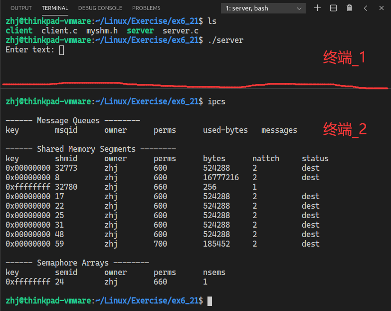

# 说明文档

## 目录

* [一、功能说明](##一、功能说明)
* [二、实现的效果](##二、实现的效果)
* [三、调试过程](##三、调试过程)
   * [3.1 问题描述](###3.1问题描述)
   * [3.2 问题分析及解决方案](###3.2问题分析及解决方案)
      * [3.2.1 解决end问题](####3.2.1解决end问题)
      * [3.2.2 解决客户端循环问题](####3.2.2解决客户端循环问题)
      * [3.2.3 解决代码流程问题](####3.2.3解决代码流程问题)
   * [3.3 效果展示](###3.3效果展示)
* [四、总结](##四、总结)

<a name="##一、功能说明"></a>

## 一、功能说明

使用共享内存加信号量的方式，控制不同的进程对共享内存的访问。解决进程之间的同步与互斥问题。

<a name="##二、实现的效果"></a>

## 二、实现的效果

程序代码在 ***Code目录*** 下，包括`server.c`、`client.c`和`myshm.h`

运行方法：

拷贝Code文件夹下的内容，使用gcc分别编译服务端server和客户端client

```c
gcc server.c -o server
gcc client.c -o client
```

然后分别在两个终端中运行serve和client。先运行server，再运行client

最终效果演示：


<a name="##三、调试过程"></a>

## 三、调试过程

因为本程序是在课本例程6-19的基础上修改的，所以我就从头到尾记录一下对例题的调试和修改过程。

<a name="###3.1问题描述"></a>

### 3.1 问题描述

按照课本的例程编写代码，会有三个文件，分别是client.c、myshm.h和server.c。用gcc进行编译，生成server和client文件。


如果此时直接启动服务端server和客户端client，程序执行过程如下


可以看到，如果此时直接运行程序，会有以下问题：

1. 客户端在接收到数据之前一直循环输出 `Data recived:`
2. 客户端接收到数据之后，一直在循环输出相同的数据
3. 客户端没有识别到由服务端发送的`"end"`数据

<a name="###3.2问题分析及解决方案"></a>

### 3.2 问题分析及解决方案

<a name="####3.2.1解决end问题"></a>

#### 3.2.1 解决"end"问题

首先分析第3个问题：客户端为什么没有识别到由服务端发送的`"end"`数据。

如果不去管信号量的相关内容，那么程序的执行过程应该是：服务端从终端接收用户的数据，并把数据送入共享内存；客户端循环接收共享内存中的数据，并把数据输出。

客户端之所以没有正确判断到"end"数据，是因为服务器并不是把原始数据送入了共享内存，而是把处理后的内容送了进去。


图.服务器关键代码

可以看到，服务器是用sprintf()函数，把一大堆东西写入了共享内存。而客户端那边，只去判断共享内存的数据**是不是**`"end"`，所以就会判断不到。

我的解决方法是，改变一下服务器数据格式，让用户输入的数据保持在数据起始位置。这样的话，客户端就可以通过strncmp函数判断前3个字符，实现数据的判断。

```c
// 服务器关键代码
for(i=0;;i++){
    printf("Enter text: ");
    // fgets(readbuf, SHMSZ, stdin);
    scanf("%s", readbuf);
    getchar();  // 回收换行符
    semaphore_P(consumer);
    sprintf(shm, "%s -> Message %d from producer %d\n", readbuf, i, getpid());
    semaphore_V(producer);
    if(strncmp(readbuf, "end", 3) == 0){
        break;
    }
}
```

```c
// 客户端关键代码
while(1){
    semaphore_V(consumer);
    semaphore_P(producer);
    printf("Data recived: %s\n", shm);
    sleep(1);
    // 判断前3个字符
    if(strncmp(shm, "end", 3) == 0){
        break;
    }
}
```

这样，第三个问题就可以解决。客户端可以正常识别到`"end"`。


<a name="####3.2.2解决客户端循环问题"></a>

#### 3.2.2 解决客户端循环问题

问题1和问题2，都涉及到了信号量。最为关键的就是对信号量的P/V操作。我就稍微写一下我对P/V操作的理解。

P操作是指进程想要获取某个资源的使用权限，当进程获取成功后，会减少该资源相应的信号量值；
V操作是指进程想要释放某个资源的使用权限，当进程释放资源后，会增加相应的信号量值。

看一下P/V操作的具体代码就会发现，他们的不同之处就在于sembuf结构体的sem_op成员。以P操作为例

```c
int semaphore_P(int sem_id){
    struct sembuf sb;
    sb.sem_num = 0;     /* 表示信号集中的第0个信号量 */
    sb.sem_op = -1;     /* 小于0表示P操作，大于0表示V操作 */
    sb.sem_flg = SEM_UNDO;      /* 信号操作标志 */
    if(semop(sem_id, &sb, 1) == -1){
        printf("semaphore_P failed!\n");
        return 0;
    }
    return 1;
}
```

我们这里设置了信号操作标志SEM_UNDO置位，这个SEM_UNDO是用来防止发生程序异常结束时，资源被永久锁定的情况，可以不用管它。

大概就是了解P/V操作是对应着申请和释放资源就可以了。

目前程序已经解决了问题3，但还是存在问题1、2的循环情况。在程序运行时，使用ipcs指令看一下进程间通信的状态，就会很好地找到问题原因。

首先启动服务端程序，然后直接在另一个终端中输入ipcs指令。



可以看到，服务端启动后，只产生了一个信号量集。这是不正常的，因为程序的本意是想要生成两个信号集，分别是consumer和producer。

那肯定是服务器的semget函数出了问题，这个函数没有正确的生成信号量集。

在具体看一下这个函数就会发现，semget函数里面还套了个ftok函数。由ftok函数生成信号量集的关键字，然后semget函数根据这个关键字，生成对应的信号量集。


值得注意的是，ftok函数是根据文件名生成的关键字，更确切的说，它是根据文件名对应文件的inode节点来生成的关键字，它的第一个参数就是文件名。但是如果这个文件名对应的文件不存在的话，肯定是会出错的。这时，ftok函数会返回-1。之所以会有问题，是因为ftok函数在生成关键字时出现了错误。

我们可以使用以下语句，检测ftok函数出错时的返回值。

```c
printf("Error Return is: %d\n", ftok("Have_No_This_File", 0));
```

这样就解释了，为什么只会产生一个信号量集。是因为ftok函数没有找到对应的文件，所以返回值为-1。然后semget把-1作为了信号量标识符，生成了对应的信号量。consumer和producer对应的文件都不存在，都会返回-1，所以就都是对应了信号量集标识符为-1的信号量集。用ipcs查看的结果也可以印证这个猜想。


可以看到，现在生成的信号量集的标识符是`0xffffffff`，也就是-1。

了解了问题原因，解决办法就有了。直接创建三个对应的文件就可以。


再次执行程序，执行过程如下


可以看到，这个测试界面是有三个终端，分别用来表示服务器、客户端以及一个用来查看ipcs的终端。

创建了三个文件之后，客户端已经可以不再循环显示了。问题1、2应该算是被解决了。

但是同时可以看到，当客户端一旦上线，就会输出一行 `Data recived:`，这就很难受。客户端上来之后，本应该什么都不显示才对。要解决这个问题，就需要对程序的流程进行仔细分析了。

<a name="####3.2.3解决代码流程问题"></a>

#### 3.2.3 解决代码流程问题

下面尝试进行程序流程分析

* 对于服务器程序

1. 服务器肯定是首先启动，它启动之后会创建两个信号量集和一个共享内存，并把两个信号量初值都设置为1
2. 进入循环，要求用户输入数据。相当于阻塞住了，直到用户输入数据为止。
3. 用户输入了数据，服务端把数据保存在了readbuf中
4. 对consumer执行P操作，相当于占用consumer的资源
5. 向共享内存写入数据
6. 对producer执行V操作，相当于释放producer的资源
7. 判断用户数据是否表示退出程序，并做相应处理

* 对于客户端程序

1. 客户端上线后，会首先将consumer和producer的信号量值都设为1，然后链接共享内存地址
2. 对consumer执行V操作，对producer执行P操作
3. 输出共享内存的数据
4. 休眠1秒钟，比较共享内存的数据是否表示退出，并作相应处理
5. 退出程序时，删除两个信号量集

这样，客户端显示 `Data recived:` 的原因就清楚了。在服务器上线后，会把两个信号量初值都设为1，然后就被scanf阻塞住了，暂时不会改变信号量。客户端上线后，又把两个信号量值重置成了1（没啥用），紧接着客户端执行V和P操作。对consumer的V操作肯定没事，但是对producer的P操作时，是可以申请到producer的资源的，这是不应该的。因为producer表示的是服务端是否生成数据完毕，正常情况下，当数据生成完毕时，客户端应该才能申请到producer的资源，执行接下来的程序。现在的情况是，服务端没有生成数据完毕，客户端就来输出了，所以是不正常的。

感觉整个程序的思路不是太好表述，大概就是：

首先客户端增加一个产生数据的信号(producer)，允许服务端产生数据；服务端在收到用户的数据后，就会申请产生数据的信号(producer)，一旦申请成功，就会向共享内存中写入数据；写完数据之后，就会释放一个允许处理的信号(consumer)，允许客户端处理共享内存里的数据。客户端一旦申请到了允许数据处理的信号(consumer)，就会输出共享内存的数据。客户端处理数据完成后，会释放一个允许数据产生的信号，允许服务器产生数据。这样，就形成了一个循环。

之所以这样设计，是为了保证共享内存中的数据，在某一时刻，只能被单一的进程访问到。只有服务端产生数据完成后，客户端才能输出数据；同样，只有客户端输出数据完成后，服务端才能再次写入数据。

大概信号量这种机制，就是为了解决进程之间对临界资源的互斥而设计的。对于存在互斥关系的两个进程，用锁定资源的方式控制访问。

回到题中，如果是按照上面的流程，我觉得信号量值的初值应该都设为0。而且只需要服务端设置初值，客户端就不用再重复设置了。可以把客户端的相关代码注释掉，再把服务端的信号量初值设为0。进行测试


可以看到，程序基本上可以了。

如果是有两个客户端同时在线，这两个客户端就会产生一种`"排队取数据"`的效果。


大概是与这两个客户端申请和释放资源的顺序有关，具体我也没再看。

<a name="###3.3效果展示"></a>

### 3.3 效果展示

另外，这个程序还有一些小细节需要注意。server运行过程中生成了一个共享内存，但是最后这个共享内存没有被删除，可以用shmctl把它删除。

还有就是，可以在程序中通过函数创建文件，程序运行完毕后后再删除相关文件。

最终效果如下


<a name="##四、总结"></a>

## 四、总结

例题6-19的本意应该是让我们了解一下，共享内存和信号量如何配合使用。通过这两种方式的配合，实现了对互斥进程访问共享资源的控制。程序最关键的代码就是两个程序的循环部分，通过P/V操作实现对信号量的增减。其他部分的代码虽然有点问题，但也不影响主要功能。

不过这个代码的流程确实有点绕。。。
