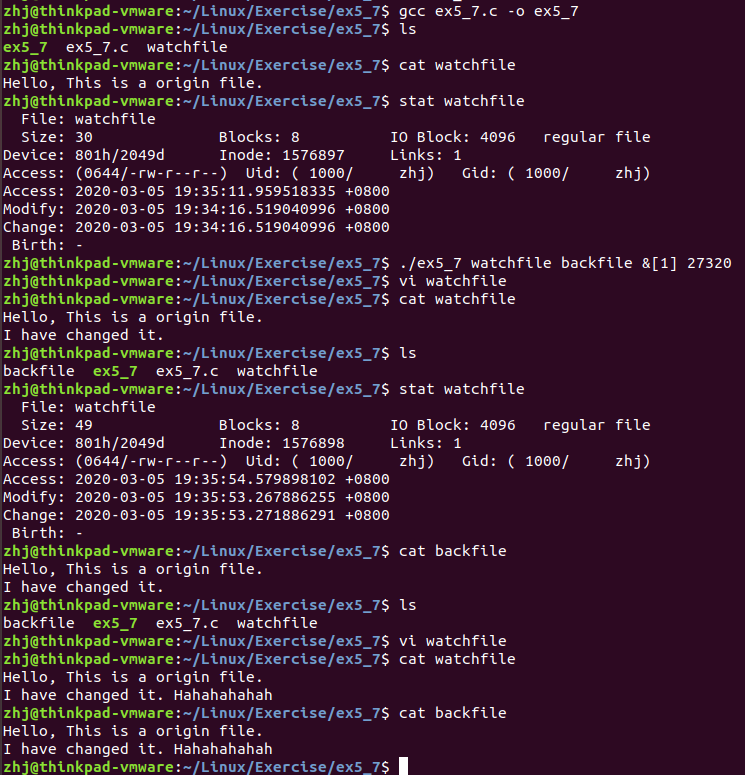

## 程序过程

本程序想要实现的功能是：对某个文件进行监视，如果该文件发生变动(st_mtime改变)，则通过exec函数族调用系统CP命令，将改动后的内容备份至目标文件

## 发现的问题及解决方案

程序测试中，如果取消本程序中第33行的注释，运行程序，会发现本程序未能正确检测到st_mtime的改变（即使它已经改变了），但是可以监控到st_atime的改变

我的猜想是：由于某些神秘的原因，程序对已打开文件描述符的文件信息`没有及时更新`，所以当前的`stbuf.st_mtime`会一直保持`old_time`的状态不会发生改变。

因此，需要设法`更新当前文件的状态信息`。

我想到的方案是：每次读取文件信息之前，都重新打开一次文件，读取文件信息后，都关闭文件。这样保证每次文件信息的实时性。

## 测试过程

> 这张图片保存在了本仓库的[其他位置](../../../Image/Exercise/ex5_7/show.png)，打开时可能较慢，请耐心等待

## 调试说明

1. 首先编译一下源文件
2. 查看一下当前目录里的文件
3. 查看一下即将被监控的文件`watchfile`里的内容
4. 查看一下`watchfile`的文件信息，主要关注`Modify Time`
5. 按照程序参数要求，后台运行程序。返回的进程号是`27320`
6. 修改`watchfile`的内容并查看
7. 修改文件内容之后，等待一小会，查看当前目录下的文件
8. 可以看到已经有了备份的文件了
9. 再次使用`stat`命令查看一下被监控文件状态，可以看到`Modify Time`确实改变了
10. 多次修改文件，被监控的文件备份也会随之修改

## 其他的改进方案

本程序可以改进的地方是，可以将备份的文件名，设置成为系统当前时间。这样，每次修改文件的备份都不会覆盖上次的备份。
