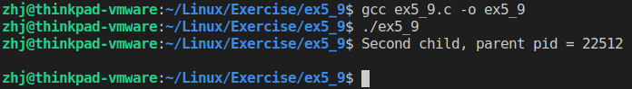

# 程序说明

> 这个程序是用来产生一个僵尸进程，同时去测试waitpid()函数的使用

1. 首先程序创建了一个子进程，同时父进程在等待该子进程的结束
2. 在子进程中，又创建了一个子进程
3. 我们将子进程中创建的父进程暂且叫做子父进程，把子进程中创建的子进程叫做子子进程
4. 在子父进程中，因为执行了exit函数，所以子进程就会立即退出，父进程的waitpid函数回收了子进程的状态信息，子进程和父进程正常结束
5. 子子进程因为没有被子父进程回收状态信息而变成僵尸进程，他会等待2秒之后，输出子父进程的PID

# 测试过程

