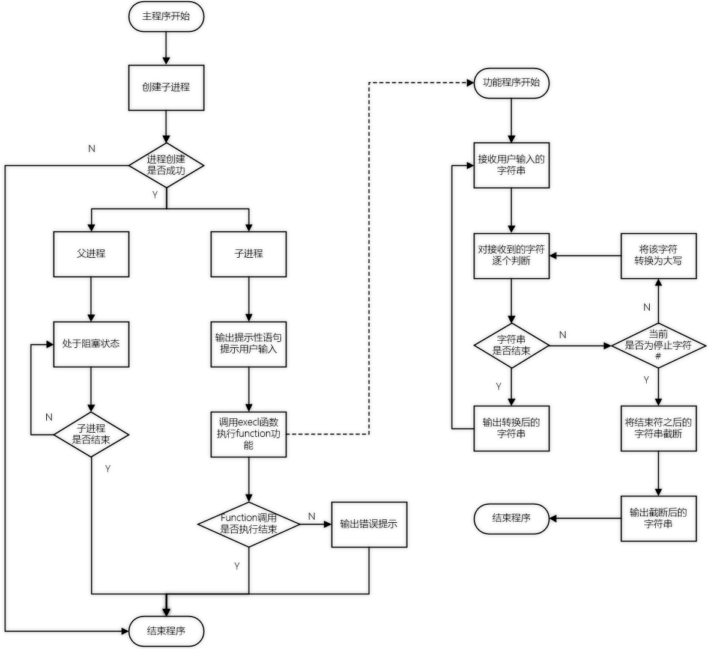
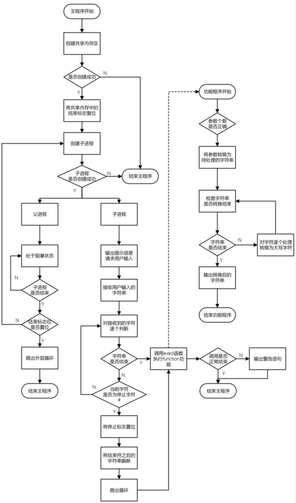

# 程序说明

> 本次实现了两个版本，实现过程相似，不同之处在于`对字符串的处理`、`execl函数的参数`以及`共享内存有无`等

## 实现的功能

编程将小写字母转换成大写字母输出。要求：

- [x] 要转换的字符从键盘读入
- [x] 生成子进程，子进程的功能是输出大写的26个字母，exec系列函数加载子进程的功能
- [x] 从键盘读入的字符作为转换函数的参数
- [x] 输入特定字符可以结束转换过程

## 程序流程图

### Version1

> 图片加载可能较慢，请耐心等待

### Version2

> 图片加载可能较慢，请耐心等待

